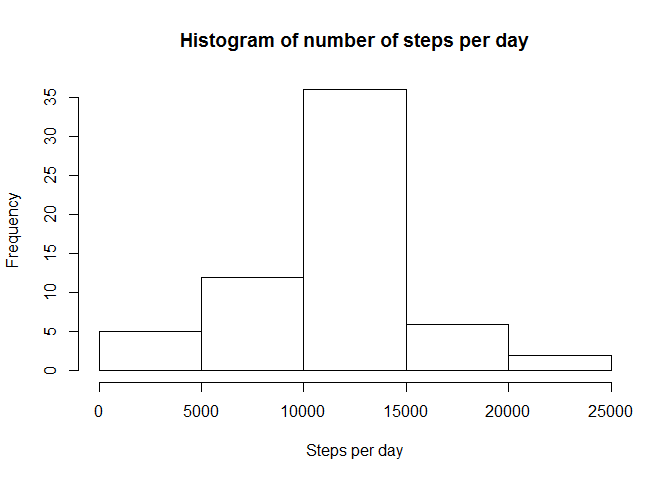
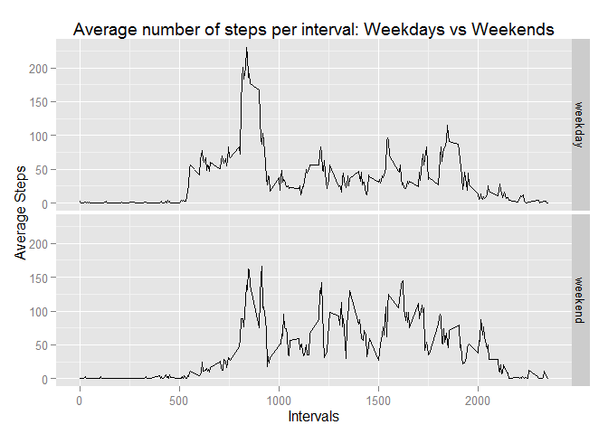

# Programming Assignment 1

This is the Markdown document to perform the analysis of the first programming assignment of the Reproducible Research course in the Coursera Data Analysis Especialization

The first step is to download a database containing **Activity Monitoring Data** from an anonymous individual collected during the months of October and November of 2012 and include the number of steps taken in 5 minute intervals each day.

##Loading and preprocessing the data

First task is to download the dataset and unzip the file to your working directory.    

The piece of code below was inpired by this answer below in Stackoverflow:    

<http://stackoverflow.com/questions/3053833/using-r-to-download-zipped-data-file-extract-and-import-data>.  

The code download and extract the file to a temp file then load it into a dataset.  


```r
temp <- tempfile()
download.file("https://d396qusza40orc.cloudfront.net/repdata%2Fdata%2Factivity.zip",temp)
data <- read.csv(unz(temp, "activity.csv"))
unlink(temp)
```


## What is the mean total number of steps taken per day?

To obtain this mean, first it is necessary to summarise the dataset per day instead of 5 minutes intervals.    


```r
data2<-na.omit(data)
library(dplyr)
```

```
## 
## Attaching package: 'dplyr'
## 
## The following objects are masked from 'package:stats':
## 
##     filter, lag
## 
## The following objects are masked from 'package:base':
## 
##     intersect, setdiff, setequal, union
```

```r
dataDay<-summarise(group_by(data2,date),sum(steps))
names(dataDay)<-c("date","steps_per_day")
hist(dataDay$steps_per_day, main="Histogram of steps per day",xlab="Steps per day")
```

 

#### Now to calculate the total **mean** and **median** of steps per day.  


```r
mean(dataDay$steps_per_day)
```

```
## [1] 10766.19
```

```r
median(dataDay$steps_per_day)
```

```
## [1] 10765
```


## What is the average daily activity pattern?

First we need to group data by intervals, not by dates:  


```r
dataInterval<-summarise(group_by(data2,interval),mean(steps))
names(dataInterval)<-c("interval","mean_steps")
plot(dataInterval$mean_steps~dataInterval$interval, type="l", main="Average number of steps per interval", xlab="Intervals", ylab="Average steps")
```

 

To find the interval that contains the maximum number of steps on average we can use the
**which.max()** function on the mean_steps column.  


```r
dataInterval[which.max(dataInterval$mean_steps),]
```

```
## Source: local data frame [1 x 2]
## 
##   interval mean_steps
##      (int)      (dbl)
## 1      835   206.1698
```

So the interval is **08:35** with an average of **206** steps.    
  
  
  
  
## Imputing missing values


This section is about NAs in the dataset.  

First step is to calculate the total number of rows with missing values.    

The **table** function can tabulate the values of NAs versus valid data points.  


```r
table(is.na(data))
```

```
## 
## FALSE  TRUE 
## 50400  2304
```

The missing values have to be filled with alternative values. One possibility is the **mean of the invervals**, as calculated previously.  

We can use the replace function to test if the value is missing and replacing it by the mean.  

The **head** command shows us that the values have been replaced.  


```r
data$steps<-replace(data$steps,is.na(data$steps),dataInterval$mean_steps)
head(data)
```

```
##       steps       date interval
## 1 1.7169811 2012-10-01        0
## 2 0.3396226 2012-10-01        5
## 3 0.1320755 2012-10-01       10
## 4 0.1509434 2012-10-01       15
## 5 0.0754717 2012-10-01       20
## 6 2.0943396 2012-10-01       25
```

Now we can plot again the histogram of sum of steps per day.  

### The previous pattern of average steps per day seems not to have changed.  


```r
dataDay2<-summarise(group_by(data,date),sum(steps))
names(dataDay2)<-c("date","sum_steps")
hist(dataDay2$sum_steps, main="Histogram of number of steps per day", xlab="Steps per day")
```

 

The mean and the median after imputing the missing values are calculated below.    

Previously they were quite close, after imputing the means for the NAs they are the same.  

That is expected since there were many NAs in the data making their replacement (the mean) the most recurrent value.   


```r
mean(dataDay2$sum_steps)
```

```
## [1] 10766.19
```

```r
median(dataDay2$sum_steps)
```

```
## [1] 10766.19
```


## Are there differences in activity patterns between weekdays and weekends?

Finally we investigate if the pattern of walking differs through the week.  

First we have to set the locale to English since not all computers have the English language as default


```r
Sys.setlocale(category = "LC_ALL", locale = "English")
```

```
## [1] "LC_COLLATE=English_United States.1252;LC_CTYPE=English_United States.1252;LC_MONETARY=English_United States.1252;LC_NUMERIC=C;LC_TIME=English_United States.1252"
```

We can then separate weekdays from weekend using a binary variable. 

First converting the date variable to POSIXlt then extracting the weekday using the **weekdays** function.  


```r
data$weekend<-weekdays(as.POSIXlt(data$date, tz="",format="%Y-%m-%d"))
data$weekend<-replace(data$weekend,data$weekend %in% c("Saturday","Sunday"),"weekend")
data$weekend<-replace(data$weekend,data$weekend != "weekend","weekday")
data$weekend<-as.factor(data$weekend)
```

Finally we plot the data comparing the steps during weekend and weekdays.  


```r
dataInterval<-summarise(group_by(data,weekend,interval),mean(steps))
names(dataInterval)<-c("weekend","interval","mean_steps")
library(ggplot2)
qplot(interval,mean_steps,data=dataInterval, geom="path")+facet_grid(weekend~.)+labs(title="Average number of steps per interval: Weekdays vs Weekends", y="Average Steps", x="Intervals")
```

 

We can see that the intervals of activities and the levels fluctuate between weekdays and weekend.  

During the weekend the activities **begin a little later during the day and less concentrated**.  

This pattern is expected since most people have more free time during weekends.  


